# Kubernetes Monitoring ve Logging Tutorial

## Task 1: Kubernetes Metrik Toplama (Helm ile)

Görev: Kubernetes üzerinde çalışan pod ve nodeların metrikleri merkezi bir yere toplayınız.
Ödev Detayı: Metrikler 90 gün, Object Storage üzerinde saklanacak
Soru: Object storage nedir? On-prem ve cloud için örnek verir misiniz?

### Amaç
Kubernetes cluster üzerindeki pod ve node metriklerini merkezi olarak toplamak ve bu metrikleri 90 gün boyunca object storage üzerinde saklamak. Tüm kurulum Helm kullanılarak otomatize edilmiştir.

### Mimari Diyagram
```
Kubernetes Cluster
   (Pods & Nodes)
         │
         ▼
    Prometheus
  (Metric toplama)
         │
         ▼
   Thanos Sidecar
(Metric blok upload)
         │
         ▼
       MinIO
   Object Storage
```

### Object Storage Nedir?
Verileri dosya yerine object olarak saklayan depolama sistemidir. Büyük ve uzun süreli veri saklama için kullanılır.

**Örnekler:**

**Cloud:**
- AWS S3
- Google Cloud Storage
- Azure Blob Storage

**On-Premise:**
- MinIO
- Ceph
- SeaweedFS

Bu projede MinIO kullanılmıştır.

### Helm ile Kurulum Adımları

#### 1. Chart oluşturma
```bash
mkdir -p metrics-tutorial/task1-metrics-collection
cd metrics-tutorial/task1-metrics-collection
helm create metrics-stack
```

#### 2. Chart bağımlılıkları
Chart.yaml içine:
```yaml
dependencies:
  - name: prometheus
  - name: minio
```
Prometheus ve MinIO Helm ile kurulur.

#### 3. values.yaml ayarları
Temel ayarlar:
```yaml
prometheus:
  server:
    retention: 90d

minio:
  rootUser: admin
  rootPassword: minio123
  persistence:
    size: 5Gi
```
- Prometheus verileri 90 gün saklar
- MinIO kalıcı storage kullanır

#### 4. Helm kurulum
```bash
kubectl create namespace metrics
helm dependency update ./metrics-stack
helm install metrics-release ./metrics-stack -n metrics
```
Tüm bileşenler otomatik kurulur.

#### 5. Servislere erişim
```bash
kubectl port-forward -n metrics svc/metrics-release-prometheus-server 9090:80
kubectl port-forward -n metrics svc/metrics-release-minio-console 9001:9001
```

### Screenshots

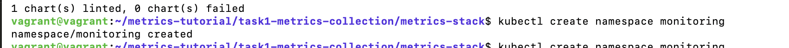
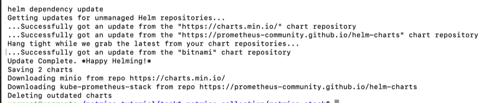
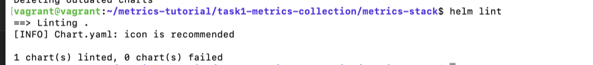
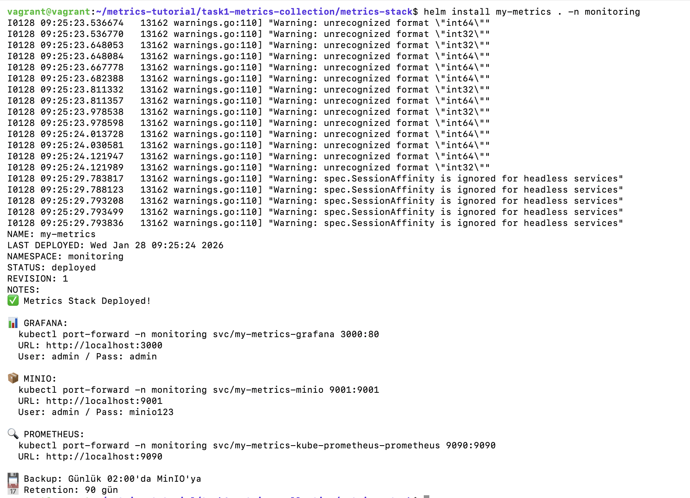

### Sonuç

**Prometheus:** http://localhost:9090
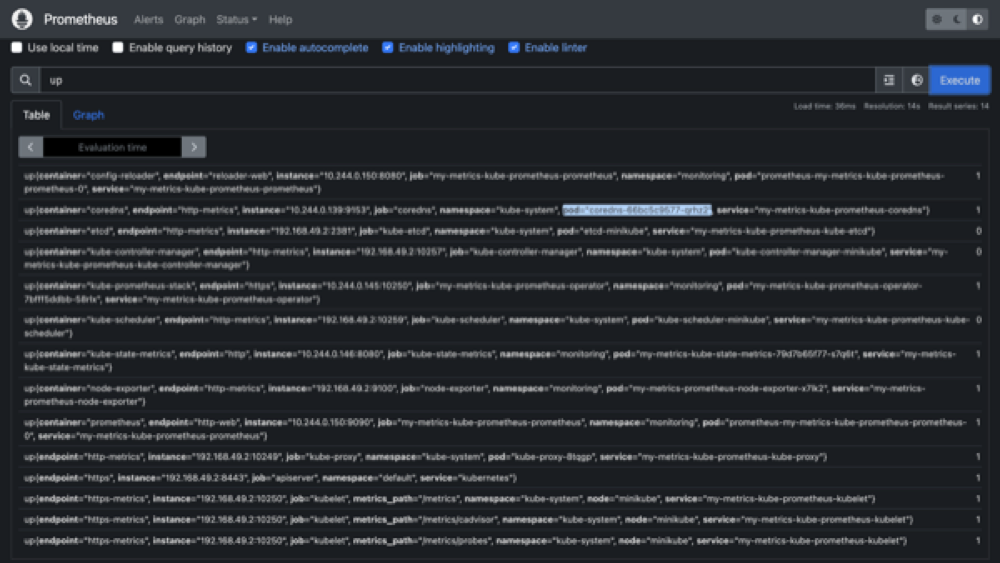

**MinIO:** http://localhost:9001 (admin/minio123)
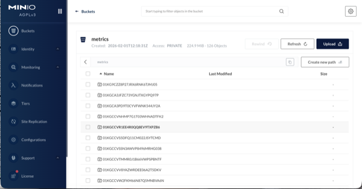
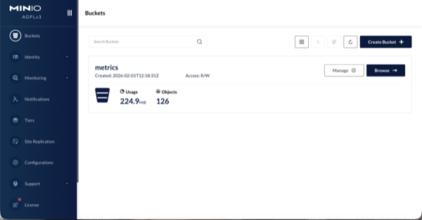

- Kubernetes pod ve node metrikleri toplanıyor
- MinIO object storage'da 90 gün saklanıyor
- Helm ile otomatize edildi

## Task 2: Kubernetes Loglarının Toplanması

Görev: Kubernetes üzerinde çalışan pod ve nodeların loglarını merkezi bir yere toplayıp, 90 gün boyunca Object Storage'da saklamak.
Soru: rsyslogd nedir?

### rsyslogd Nedir?
rsyslogd = Rocket-fast Syslog Daemon

Linux sistemlerinde log mesajlarını toplayıp, işleyip depolayan bir servistir.
Sistem loglarını merkezi bir yere gönderir, filtreleme ve yönlendirme yapabilir.
/var/log/ dizininde logları depolar.

Task 2'de rsyslog kullanmadık çünkü:
- Object Storage'a doğrudan yazamaz
- Kubernetes pod loglarını otomatik olarak toplayamaz
- Ağır ve geleneksel bir çözüm

### Yapılan İşlemler

#### 1. Proje Yapısı
```bash
mkdir -p ~/metrics-tutorial/task2-logs-collection
cd ~/metrics-tutorial/task2-logs-collection
helm create logs-stack
```

#### 2. Chart.yaml (Dependencies)
```yaml
dependencies:
  - name: fluent-bit
    version: "0.20.0"
  - name: minio
    version: "5.0.0"
```

#### 3. values.yaml (Konfigürasyon)
```yaml
fluent-bit:
  config:
    inputs: |
      [INPUT]
          Name tail
          Tag kube.*
          Path /var/log/containers/*.log
          Parser docker
    outputs: |
      [OUTPUT]
          Name s3
          Match kube.*
          bucket logs
          s3_key_format /logs/%Y/%m/%d/%H/%M/%S-$UUID.log

minio:
  rootUser: admin
  rootPassword: minio123
  persistence:
    size: 2Gi
  buckets:
    - name: logs
```

#### 4. Kurulum
```bash
kubectl create namespace logs
helm dependency update ./logs-stack
helm install logs-release ./logs-stack -n logs
```

#### 5. Erişim
```bash
kubectl port-forward -n logs svc/logs-release-minio-console 9002:9001 &
```

#### 6. Doğrulama
```bash
kubectl get pods -n logs
kubectl logs -n logs logs-release-fluent-bit-xxxxx
```

#### Sonuç

MinIO Console - http://localhost:9002 (admin/minio123):
"logs" bucket'ında pod logları saklanıyor.

Kubernetes pod/node logları Fluent-bit ile toplanıyor.
MinIO object storage'da 90 gün saklanıyor.
DaemonSet ile her node'da otomatik çalışıyor.

## Task 3: Grafana ile Görselleştirme

### Utilization Nedir?
Utilization, bir sistem kaynağının toplam kapasitesine göre ne kadarının aktif olarak kullanıldığını ifade eder.


### Kurulum
```bash
kubectl create namespace visualization
helm install visualization-release ./visualization-stack -n visualization
```

### Görselleştirilen Metrikler

**Node Metrikleri:**
- Node CPU Utilization (%)
- Node Memory Utilization (%)

**Pod Metrikleri:**
- Pod CPU Usage
- Pod Memory Usage

### Kullanılan PromQL Query'leri

**Node CPU Utilization (%):**
```promql
100 * (1 - avg by (instance) (rate(node_cpu_seconds_total{mode="idle"}[5m])))
```

**Node Memory Utilization (%):**
```promql
100 * (1 - (node_memory_MemAvailable_bytes / node_memory_MemTotal_bytes))
```

**Pod CPU Usage:**
```promql
sum by (pod) (
  rate(container_cpu_usage_seconds_total{container!="",pod!=""}[5m])
)
```

**Pod Memory Usage (MB):**
```promql
sum by (pod) (
  container_memory_working_set_bytes{container!="",pod!=""}
) / 1024 / 1024
```

### Dashboard'lar
- **Kubernetes Cluster**: Genel cluster durumu
- **Resource Utilization**: Node ve pod kaynak kullanımı
- **Node Exporter Full**: Detaylı node metrikleri

### Erişim
- **Grafana**: http://localhost:3000 (admin/grafana123)
- **Prometheus**: http://localhost:8080

### Screenshots

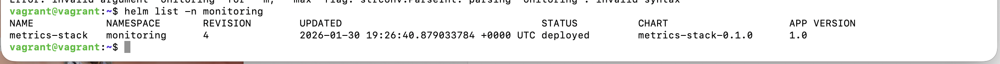
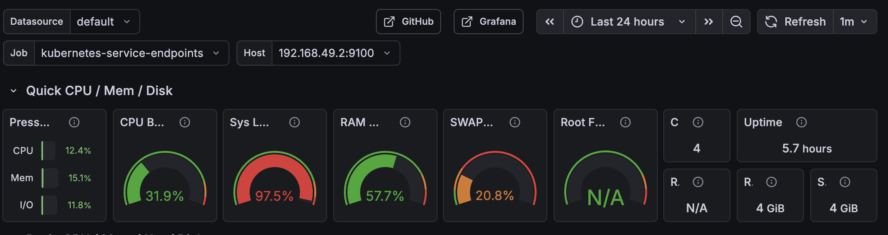
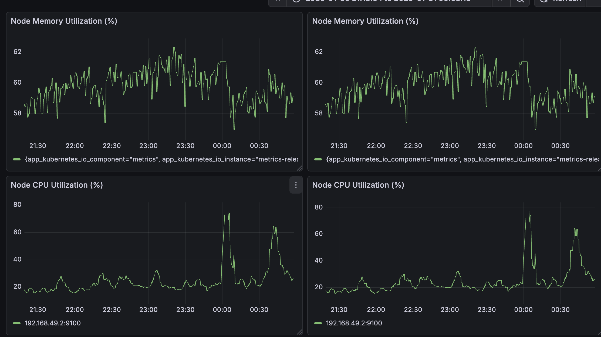
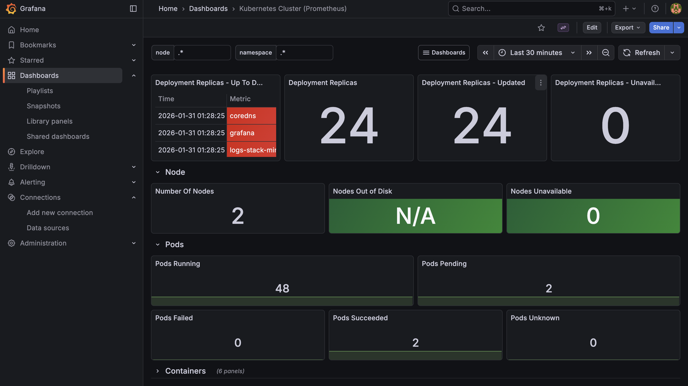

### Sonuç
Kubernetes cluster'ındaki node ve pod metrikleri Grafana ile başarıyla görselleştirildi. Sistem kaynaklarının utilization değerleri izlenebilir hale getirildi.

## Task 4: Kelime ile Arama (Search)

Görev: Logların içerisinde arama yapın
Ödev Detayı: Topladığınız pod ve nodeların loglarının içerisinde "error" ve "info" kelimelerini aratın ve kaç adet bulduğunuzu görselleştirin
Soru: Search engine nedir?

### Search Engine Nedir?
Search engine, büyük miktardaki veri içerisinde belirli kelime veya desenlere göre hızlı arama yapmayı sağlayan sistemdir. Log yönetiminde search engine; uygulama, pod ve node logları içerisinden error, info gibi kritik kayıtları bulmak ve analiz etmek için kullanılır. Bu görevde Grafana Loki, loglar üzerinde arama yapan bir search engine olarak kullanılmıştır.

### Yapılan İşlemler
- Kubernetes pod ve node logları Loki ile toplandı
- Loglar içerisinde "error" ve "info" kelimeleri arandı
- Bulunan kayıt sayıları Grafana üzerinde görselleştirildi

### Kullanılan Query'ler

#### ERROR log sayısı (son 30 dakika)
```logql
sum(
  count_over_time(
    {job=~".+"}
    | json
    | log=~".*(error|ERROR).*"
    [30m]
  )
)
```

#### INFO log sayısı (son 30 dakika)
```logql
sum(
  count_over_time(
    {job=~".+"}
    | json
    | log=~".*level=info.*"
    [30m]
  )
)
```

### Screenshot

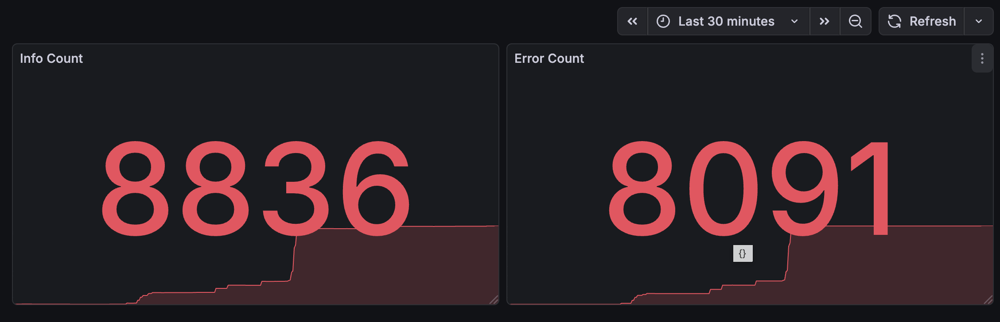

## Task 5: Alarm Üretme

Görev: CPU ve Memory kullanımı için alarm üretin
Ödev Detayı: CPU utilization 5 dakika boyunca %200 kullanıldığında ve Memory kullanımı 1 dakika boyunca %90 olduğunda alarm üretin
Soru: İncident nedir? Nasıl manage edilir?

### İncident Nedir?
İncident, sistem veya servislerin normal çalışmasını engelleyen beklenmeyen olay veya durumdur. Örneğin; sistem çökmesi, performans düşüklüğü, güvenlik ihlali gibi durumlar incident olarak kabul edilir.

**İncident Management Süreci:**
1. **Detection** - Otomatik monitoring veya kullanıcı bildirimi ile tespit
2. **Response** - İlk müdahale ekibinin devreye girmesi
3. **Diagnosis** - Problemin kök nedeninin analizi
4. **Resolution** - Geçici veya kalıcı çözümün uygulanması
5. **Recovery** - Sistemin normal duruma getirilmesi
6. **Post-Incident Review** - Olayın analizi ve iyileştirme önerilerinin çıkarılması

### Yapılan İşlemler

**Amaç:** CPU ve Memory metrikleri belirlenen eşikleri aştığında otomatik alarm üretmek ve mail ile bildirmek. Tüm yapı Helm + configuration (provisioning) ile kurulmuştur, UI üzerinden manuel işlem yapılmamıştır.

**Kullanılan Bileşenler:**
- Prometheus → Metrikleri toplar
- Node Exporter → Node CPU / Memory metriklerini üretir
- Grafana → Metrikleri okur, alarm üretir
- Grafana Unified Alerting → Alert değerlendirme & bildirim
- SMTP (Gmail) → Mail gönderimi
- Helm → Tüm konfigürasyonun yönetimi

**Genel Akış:**
Node Metrics → Prometheus → Grafana → Alert Rule (YAML) → Alertmanager (Grafana) → SMTP → Mail

### Alert Rule'lar Nasıl Tanımlandı?

Alert kuralları UI'dan değil, `rules.yaml` dosyası ile tanımlandı. Bu dosya:
- CPU / Memory hesaplama ifadelerini (PromQL)
- Eşik değerleri
- Firing süresini (for)
- Label ve annotation'ları içerir

**Örnek (Memory):**
```promql
100 * (1 - (node_memory_MemAvailable_bytes / node_memory_MemTotal_bytes)) > 90
```

### ConfigMap Kullanımı

Grafana alert rule'ları container içinden dosya olarak okumak zorundadır. Bu yüzden:

```bash
kubectl create configmap grafana-alerts --from-file=rules.yaml
```

### Mount Mantığı

Grafana Helm chart'ında şu ayar yapıldı:

```yaml
extraConfigmapMounts:
  - name: grafana-alerts
    configMap: grafana-alerts
    mountPath: /etc/grafana/provisioning/alerting
    readOnly: true
```

Bu ne anlama geliyor?
- `grafana-alerts` ConfigMap'i
- Grafana container'ının içine `/etc/grafana/provisioning/alerting` dizinine
- dosya olarak mount edilir
- Grafana startup sırasında bu dizini tarar ve alert rule'ları otomatik yükler

### SMTP (Mail) Konfigürasyonu

Mail gönderimi Grafana üzerinden yapılır:
- SMTP ayarları `grafana.ini` ile verildi
- Gmail için App Password kullanıldı
- Alert firing olduğunda mail otomatik gönderildi

### Deploy

```bash
helm upgrade --install metrics-stack . \
  -n monitoring \
  -f values.yaml \
  -f values-task5.yaml
```

### Screenshots


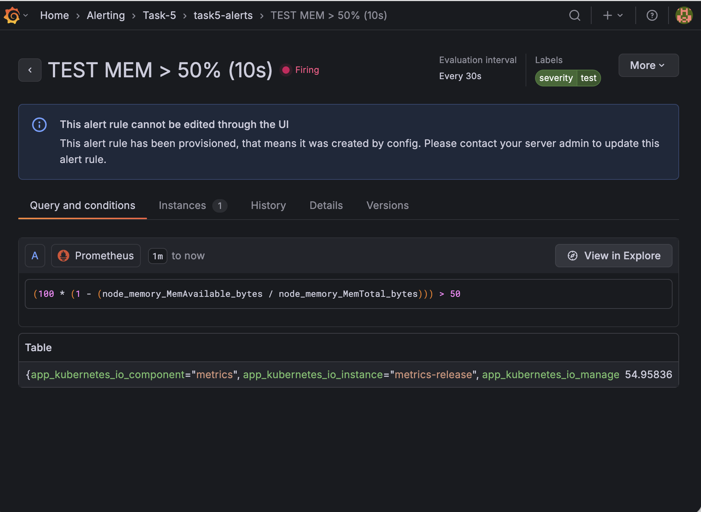
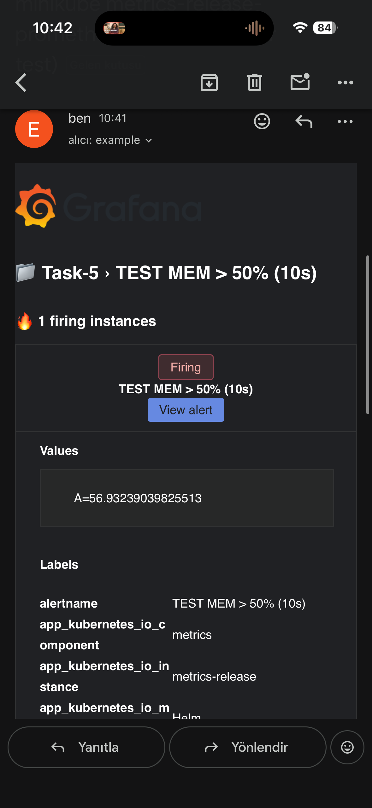

### Sonuç
- Alert rule'lar Helm ile tanımlandı
- ConfigMap + volume mount ile Grafana'ya okutuldu
- Alert firing olduğunda mail başarıyla gönderildi

done