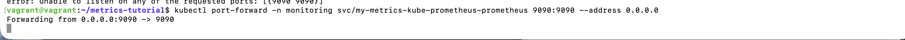
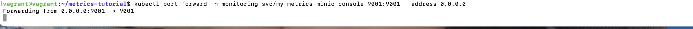

# Kubernetes Monitoring ve Logging Tutorial

## Task 1: Kubernetes Metrik Toplama

Görev: Kubernetes üzerinde çalışan pod ve nodeların metrikleri merkezi bir yere toplayınız.
Ödev Detayı: Metrikler 90 gün, Object Storage üzerinde saklanacak
Soru: Object storage nedir? On-prem ve cloud için örnek verir misiniz?

### Object Storage Nedir?
Verileri objeler halinde saklayan depolama türü.

Cloud: AWS S3, Google Cloud Storage, Azure Blob
On-Premise: MinIO, Ceph, SeaweedFS

### Yapılan İşlemler

#### 1. Proje Yapısı
```bash
mkdir -p metrics-tutorial/task1-metrics-collection
cd metrics-tutorial/task1-metrics-collection
helm create metrics-stack
```

#### 2. Chart.yaml (Dependencies)
```yaml
dependencies:
  - name: prometheus
    version: "25.0.0"
  - name: minio
    version: "5.0.0"
```

#### 3. values.yaml (Konfigürasyon)
```yaml
prometheus:
  prometheusSpec:
    retention: 90d
    retentionSize: "2GB"

minio:
  rootUser: admin
  rootPassword: minio123
  persistence:
    size: 1Gi
  buckets:
    - name: metrics
```

#### 4. Kurulum
```bash
kubectl create namespace metrics
helm dependency update ./metrics-stack
helm install metrics-release ./metrics-stack -n metrics
```


#### 5. Erişim
```bash
ssh vagrant@192.168.56.10
kubectl port-forward -n metrics svc/metrics-release-prometheus-server 9090:80 &
kubectl port-forward -n metrics svc/metrics-release-minio-console 9001:9001 &
```




#### Sonuç

Prometheus - http://localhost:9090:


MinIO - http://localhost:9001 (admin/minio123):


Kubernetes pod ve node metrikleri toplanıyor.
MinIO object storage'da 90 gün saklanıyor.
Helm ile otomatize edildi.

## Task 2: Kubernetes Loglarının Toplanması

Görev: Kubernetes üzerinde çalışan pod ve nodeların loglarını merkezi bir yere toplayıp, 90 gün boyunca Object Storage'da saklamak.
Soru: rsyslogd nedir?

### rsyslogd Nedir?
rsyslogd = Rocket-fast Syslog Daemon

Linux sistemlerinde log mesajlarını toplayıp, işleyip depolayan bir servistir.
Sistem loglarını merkezi bir yere gönderir, filtreleme ve yönlendirme yapabilir.
/var/log/ dizininde logları depolar.

Task 2'de rsyslog kullanmadık çünkü:
- Object Storage'a doğrudan yazamaz
- Kubernetes pod loglarını otomatik olarak toplayamaz
- Ağır ve geleneksel bir çözüm

### Yapılan İşlemler

#### 1. Proje Yapısı
```bash
mkdir -p ~/metrics-tutorial/task2-logs-collection
cd ~/metrics-tutorial/task2-logs-collection
helm create logs-stack
```

#### 2. Chart.yaml (Dependencies)
```yaml
dependencies:
  - name: fluent-bit
    version: "0.20.0"
  - name: minio
    version: "5.0.0"
```

#### 3. values.yaml (Konfigürasyon)
```yaml
fluent-bit:
  config:
    inputs: |
      [INPUT]
          Name tail
          Tag kube.*
          Path /var/log/containers/*.log
          Parser docker
    outputs: |
      [OUTPUT]
          Name s3
          Match kube.*
          bucket logs
          s3_key_format /logs/%Y/%m/%d/%H/%M/%S-$UUID.log

minio:
  rootUser: admin
  rootPassword: minio123
  persistence:
    size: 2Gi
  buckets:
    - name: logs
```

#### 4. Kurulum
```bash
kubectl create namespace logs
helm dependency update ./logs-stack
helm install logs-release ./logs-stack -n logs
```

#### 5. Erişim
```bash
kubectl port-forward -n logs svc/logs-release-minio-console 9002:9001 &
```

#### 6. Doğrulama
```bash
kubectl get pods -n logs
kubectl logs -n logs logs-release-fluent-bit-xxxxx
```

#### Sonuç

MinIO Console - http://localhost:9002 (admin/minio123):
"logs" bucket'ında pod logları saklanıyor.

Kubernetes pod/node logları Fluent-bit ile toplanıyor.
MinIO object storage'da 90 gün saklanıyor.
DaemonSet ile her node'da otomatik çalışıyor.

## Task 3: Grafana ile Görselleştirme

### Utilization Nedir?
Utilization, bir sistem kaynağının toplam kapasitesine göre ne kadarının aktif olarak kullanıldığını ifade eder.

**Örnekler:**
- CPU utilization %70 → CPU'nun %70'i kullanılıyor
- Memory utilization %40 → Belleğin %40'ı kullanılıyor

### Kurulum
```bash
kubectl create namespace visualization
helm install visualization-release ./visualization-stack -n visualization
```

### Görselleştirilen Metrikler

**Node Metrikleri:**
- Node CPU Utilization (%)
- Node Memory Utilization (%)

**Pod Metrikleri:**
- Pod CPU Usage
- Pod Memory Usage

### Kullanılan PromQL Query'leri

**Node CPU Utilization (%):**
```promql
100 * (1 - avg by (instance) (rate(node_cpu_seconds_total{mode="idle"}[5m])))
```

**Node Memory Utilization (%):**
```promql
100 * (1 - (node_memory_MemAvailable_bytes / node_memory_MemTotal_bytes))
```

**Pod CPU Usage:**
```promql
sum by (pod) (
  rate(container_cpu_usage_seconds_total{container!="",pod!=""}[5m])
)
```

**Pod Memory Usage (MB):**
```promql
sum by (pod) (
  container_memory_working_set_bytes{container!="",pod!=""}
) / 1024 / 1024
```

### Dashboard'lar
- **Kubernetes Cluster**: Genel cluster durumu
- **Resource Utilization**: Node ve pod kaynak kullanımı
- **Node Exporter Full**: Detaylı node metrikleri

### Erişim
- **Grafana**: http://localhost:3000 (admin/grafana123)
- **Prometheus**: http://localhost:8080

### Sonuç
Kubernetes cluster'ındaki node ve pod metrikleri Grafana ile başarıyla görselleştirildi. Sistem kaynaklarının utilization değerleri izlenebilir hale getirildi.