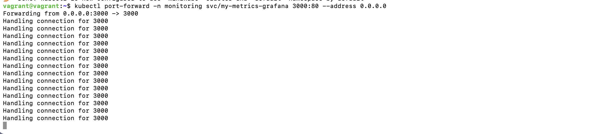
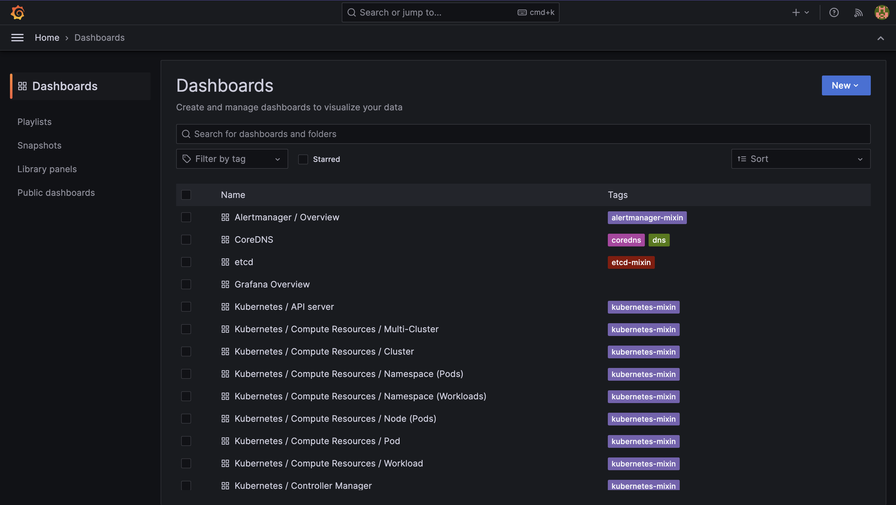

# Task 1: Kubernetes Metrik Toplama

Görev: Kubernetes üzerinde çalışan pod ve nodeların metrikleri merkezi bir yere toplayınız.

Ödev Detayı: Metrikler 90 gün, Object Storage üzerinde saklanacak

Soru: Object storage nedir? On-prem ve cloud için örnek verir misiniz?

## Object Storage Nedir?
Verileri objeler halinde saklayan depolama türü.

Cloud: AWS S3, Google Cloud Storage, Azure Blob
On-Premise: MinIO, Ceph, SeaweedFS

## Prometheus - MinIO - Grafana İlişkisi

**Prometheus**: Kubernetes cluster'dan metrikleri toplar (CPU, memory, pod durumu)
**MinIO**: Prometheus'un topladığı metrikleri object storage'da saklar (90 gün)
**Grafana**: Prometheus'tan metrikleri okuyup dashboard'larda görselleştirir

Akış: Kubernetes → Prometheus (toplama) → MinIO (saklama) → Grafana (görselleştirme)

## Yapılanlar

### 1. Proje Yapısı Oluşturuldu
```bash
mkdir -p metrics-tutorial/task1-metrics-collection
cd metrics-tutorial/task1-metrics-collection
helm create metrics-stack
cd metrics-stack
rm -rf templates/*
rm values.yaml
```

### 2. Helm Chart Yapılandırıldı
Chart.yaml oluşturuldu (MinIO + Prometheus dependencies)

values.yaml oluşturuldu:
- Prometheus retention: 90d (90 gün tutma)
- retentionSize: 4GB (maksimum boyut)
- MinIO bucket: metrics (merkezi depolama)
- Storage: 5Gi

backup-cronjob.yaml eklendi (günlük saat 02:00 backup)
NOTES.txt eklendi (erişim bilgileri)

### 3. Vagrantfile Güncellendi
Port forwarding için şu satırlar eklendi:
```
config.vm.network "forwarded_port", guest: 3000, host: 3000
config.vm.network "forwarded_port", guest: 9001, host: 9001  
config.vm.network "forwarded_port", guest: 9090, host: 9090
```

Vagrant reload yapıldı.

### 4. Kubernetes'e Deploy Edildi

Namespace oluşturuldu:


Helm dependencies indirildi:


Chart doğrulandı:


Helm ile kurulum yapıldı:


Port forwarding yapıldı:



## Sonuç

Grafana - http://localhost:3000 (admin/admin):


MinIO - http://localhost:9001 (admin/minio123):


Prometheus - http://localhost:9090:


Kubernetes pod ve node metrikleri Prometheus ile toplanıyor.
Metrikler MinIO object storage'da merkezi olarak 90 gün saklanıyor.
Backup cronjob günlük çalışıyor.